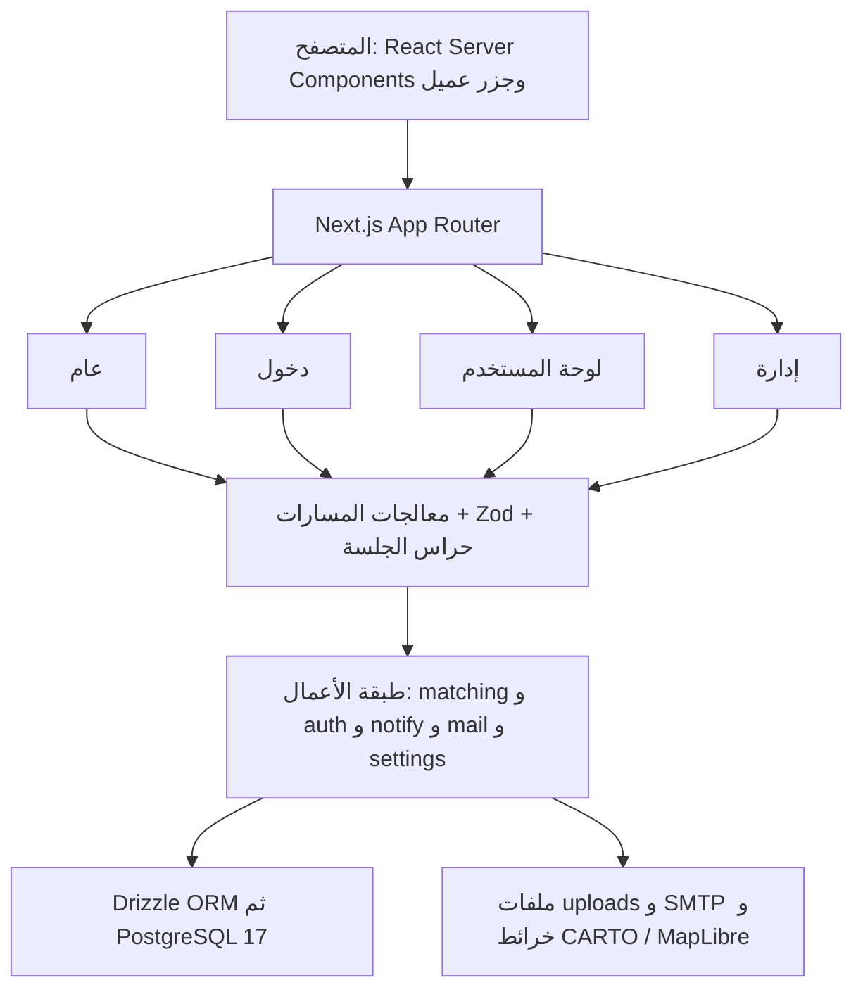
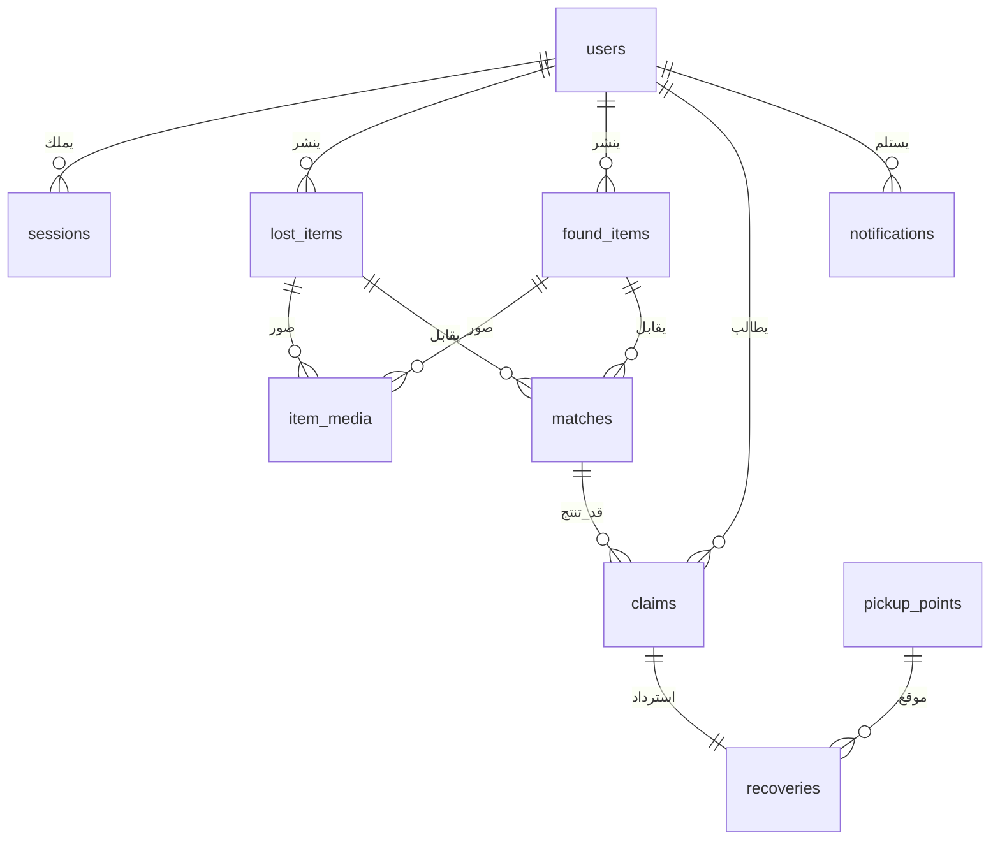
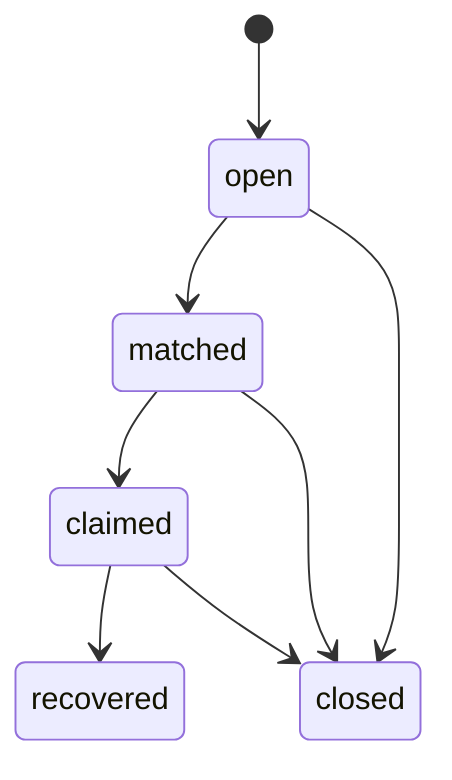
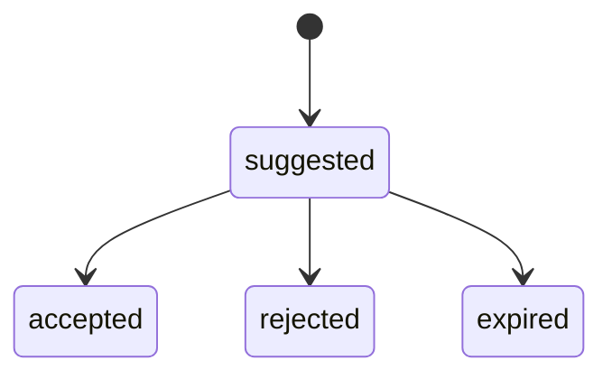
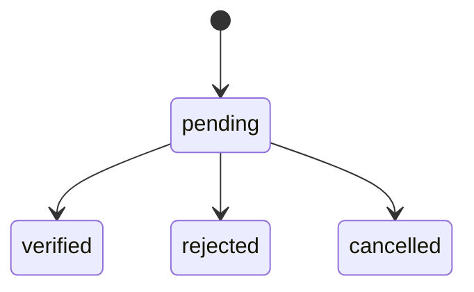
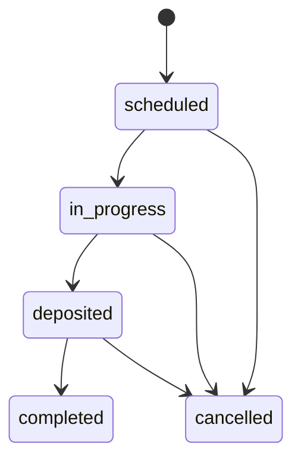
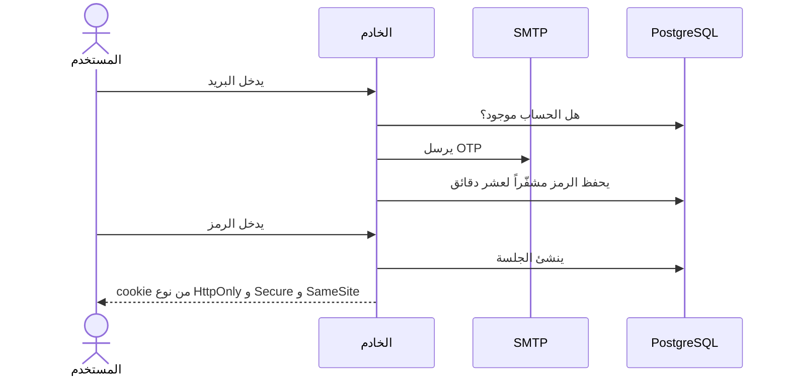
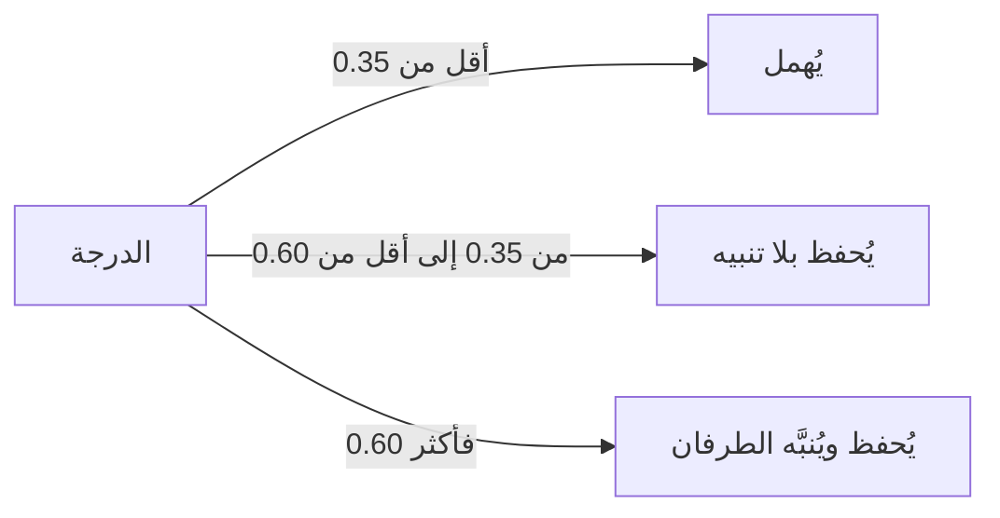

# وثيقة العمارة البرمجية (SAD)

واصل، منصة المفقودات والموجودات. الإصدار 2.0 بتاريخ 3 سبتمبر 2026. الشكل مونوليث طبقي فوق Next.js App Router.

## 1. النظرة العامة

واصل تطبيق ويب واحد فيه الواجهة ومنطق الأعمال ومسارات HTTP. يناسب فريقاً صغيراً ومدينة واحدة، ولا يحتاج طوابير أو خدمات إضافية.

## 2. التقنيات

| الطبقة | الاختيار | السبب |
|---|---|---|
| الإطار | Next.js 16 (App Router) | صفحات الخادم ومسارات API في مشروع واحد |
| اللغة | TypeScript 5 على Node 22 أو أحدث | الأنواع تتوافق مع Drizzle و Zod |
| الواجهة | React 19 و Tailwind CSS 4 | تصميم واحد بلا طبقات إضافية |
| قاعدة البيانات | PostgreSQL 17 | علاقات وحالات واستعلام جغرافي بسيط |
| ORM | Drizzle | خفيف والمخطط موجود في `src/db/schema` |
| المصادقة | Better Auth ببريد OTP | جلسة في Postgres بلا كلمة مرور |
| التحقق من المدخلات | Zod 4 | كل طلب API يُفحص قبل الكتابة |
| الخرائط | MapLibre مع CARTO Voyager | تحديد موقع الفقدان أو العثور |
| البريد | Nodemailer | إرسال رمز الدخول |
| التشغيل | Docker standalone و Compose | بناء واحد يعمل مع Postgres |

لا تُضاف قواعد بيانات أخرى ولا طوابير ولا مخازن كائنات خارج هذا المكدس.

## 3. المكوّنات الرئيسية

الصفحات العامة `/home` و `/search` و `/about` و `/items/[type]/[id]` لا تحتاج جلسة. صفحات الدخول `/login` و `/register` و `/forgot-password` للزائر. لوحة المستخدم تحت `/dashboard` (البلاغات والمطابقات والمطالبات والاسترداد والإشعارات والملف) تمر على `requireUser`. لوحة الإدارة تحت `/admin` (المستخدمون والبلاغات ونقاط الأمانة والإعدادات والسجل) تمر على `requireAdmin`.

منطق الأعمال في `src/lib`. `auth.ts` يضبط Better Auth والجلسة والدوال `getSession` و `requireUser` و `requireAdmin`. `matching.ts` يحسب الدرجة ويشغّل المحرك ويكتب صفوف `matches`. `normalize.ts` يطبّع العربية ويقارن إثبات الملكية. `notify.ts` يدرج صفوفاً في `notifications`. `mail.ts` يرسل رمز OTP. `settings.ts` يقرأ إعدادات المنصة ويحدّثها. `media.ts` و `upload-store.ts` يرفعان الصور ويربطانها بالبلاغ. `audit.ts` يكتب سجل التدقيق. `map.ts` يمرّر مفتاح الخريطة ويضبط طلب البلاط.

مسارات HTTP تحت `src/app/api` تغطي البلاغات والوسائط والمطابقات والمطالبات والاسترداد والإشعارات ونقاط الأمانة. المصادقة تمر عبر `/api/auth/[...all]` و `/api/auth/send-otp`.

## 4. قاعدة البيانات

المخطط في `src/db/schema`. ملفات الترحيل في `drizzle/` وتُطبَّق عند إقلاع الخادم.

`auth.ts` فيه المستخدمون (بريد فريد، هاتف اختياري، دور user أو admin) والجلسات والحسابات ورموز التحقق. `items.ts` فيه بلاغات المفقود والموجود مع `secret_details` والإحداثيات، وصور `item_media` المرتبطة ببلاغ واحد. `matching.ts` فيه أزواج المطابقة والدرجة وتأكيد الطرفين، والمطالبات مع وصف الإثبات، ونقاط الأمانة، وسجل استرداد واحد لكل مطالبة مع رمز تسليم. `system.ts` فيه الإشعارات الداخلية وسجل التدقيق وإعدادات المنصة كمفتاح وقيمة JSON.

حالات كل كيان:

## 5. التدفقات التقنية

### 5.1 الدخول

### 5.2 محرك المطابقة

يُشغَّل الأمر `npm run match:run`، أو يعمل تلقائياً عند إنشاء بلاغ إن فُعّل ذلك في الإعدادات.

الدرجة تساوي تشابه العنوان مضروباً في 0.40، زائد تشابه الوصف مضروباً في 0.15، زائد تطابق التصنيف مضروباً في 0.25، زائد القرب الجغرافي مضروباً في 0.20. تشابه النص Jaccard بعد تطبيع العربية. التصنيف واحد إن تطابق وإلا صفر. الموقع يُحسب بـ Haversine: واحد ناقص أصغر قيمة بين المسافة بالكيلومتر مقسومة على 50 وبين واحد.

لا تُقارن بلاغات المستخدم مع نفسه. الأوزان والعتبات تُعدَّل من لوحة الإدارة.

### 5.3 التحقق الأعمى

صاحب البلاغ يخزّن `secret_details`. المطالب يكتب وصف إثبات. الخادم يحسب تداخل الكلمات ولا يعيد السر في أي واجهة عامة. النتيجة تُحفظ كملاحظة مراجعة، وتبقى المطالبة قيد المراجعة حتى القبول أو الرفض.

### 5.4 التسليم

بعد توثيق المطالبة يُنشأ سجل استرداد فيه نقطة الأمانة والموعد ورمز التسليم. إذا أكّد الطرفان انتقلت الحالة إلى مكتمل وأُغلق البلاغان كمُسترجَعين.

## 6. التكاملات الخارجية

| التكامل | الاستخدام | ملاحظة |
|---|---|---|
| PostgreSQL | المصدر الوحيد للبيانات | Docker محلياً، ونفس المحرك في الإنتاج |
| SMTP | إرسال OTP | عبر Nodemailer |
| CARTO و MapLibre | خريطة الموقع | المفتاح يُمرَّر وقت الطلب، وحاوية الخريطة تُثبت LTR حتى لا ينعكس البلاط تحت الصفحة العربية |
| نظام الملفات | صور البلاغات | المجلد `uploads/` داخل الحاوية، بلا مخزن سحابي |

لا يوجد طابور رسائل ولا بوابة دفع ولا خدمة بحث منفصلة.

## 7. قرارات معمارية

| القرار | الاختيار | السبب |
|---|---|---|
| شكل النظام | مونوليث | فريق صغير ونطاق واحد |
| المصادقة | بريد OTP وجلسات Postgres | أبسط من كلمات المرور هنا |
| المطابقة | سكريبت أو إجراء خادم | حجم البيانات صغير ولا حاجة لطابور |
| التخزين | قرص محلي | بلا تكلفة سحابية في هذه المرحلة |
| ORM | Drizzle فقط | مخطط واحد بأنواع واضحة، بلا SQL خام وبلا Prisma |
| الجوال | مؤجَّل | مسارات Next نفسها تُفتح لاحقاً كـ REST |
