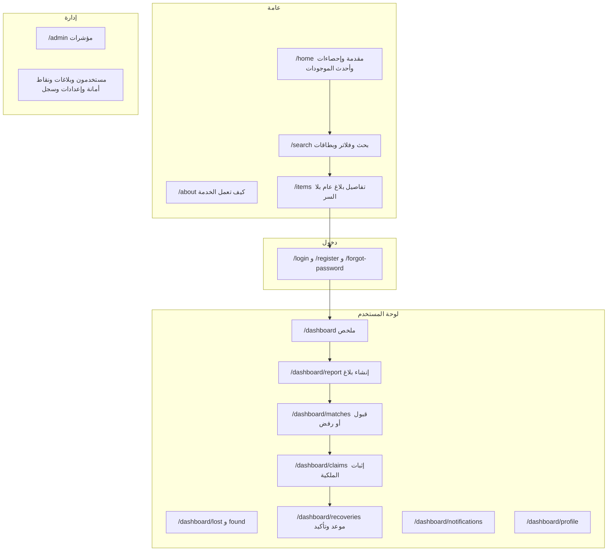
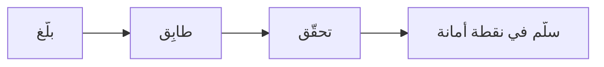
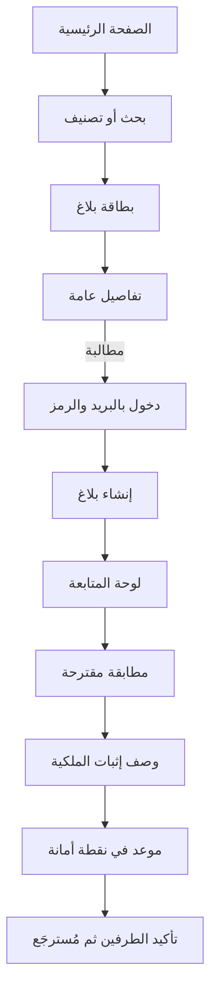

# مواصفات تجربة المستخدم والتصميم (UX/UI)

واصل، منصة المفقودات والموجودات. الإصدار 2.0 بتاريخ 3 سبتمبر 2026. الجمهور سكان عتق وشبوة، ومعظمهم يدخل من الهاتف.

## 1. كيف يعالج التصميم المشكلة

| المشكلة | القرار |
|---|---|
| الناس لا يثقون بمنصة لا يعرفونها | لغة هادئة، شعار دبوس فيه قلب، شريط «آمنة. موثوقة. في خدمتك»، والتسليم في نقطة أمانة لا في لقاء عشوائي |
| كشف التفاصيل يسهّل الاحتيال | حقل التفاصيل السرية يوضح أنها لن تُشارَك، والبطاقة العامة تعرض العنوان والصورة والتصنيف فقط |
| المستخدم على عجلة ويستخدم هاتفاً | إطار بعرض هاتف، خطوات قصيرة، تنقّل سفلي، وأيقونات SVG بدل الرموز التعبيرية |
| العربية تحتاج قراءة مريحة | الصفحة باتجاه rtl، خط IBM Plex Sans Arabic، حجم النص 16 بكسل على الأقل، وارتفاع السطر 1.65 |

التصميم يسعى إلى الثقة والوضوح والأمان، بأقل عدد من الخطوات.

## 2. نظام التصميم

الخط IBM Plex Sans Arabic. اللون الأساسي كحلي `#2a3a56` على خلفية `#f4f7fc`. الأيقونات SVG مضمّنة في المشروع ولا تُستخدم إيموجي في الأزرار أو القوائم. الشعار دبوس فيه قلب، بجانب عبارة «واصل / خدمة محلية».

| الحالة | اللون | الشارة |
|---|---|---|
| مفتوح | كحلي | مفتوح |
| مطابَق | بنفسجي | مطابَق |
| مطالَب | برتقالي `#d97706` | مطالَب |
| مُسترجَع | أخضر `#16a34a` | مُسترجَع |
| مغلق | رمادي `#6b7890` | مغلق |

على الهاتف عمود واحد وتنقّل سفلي. على الجهاز اللوحي عمودان. على سطح المكتب شبكة أوسع مع شريط جانبي. أصغر عرض مدعوم 320 بكسل.

## 3. هيكل الشاشات

الإطار المشترك `PortalChrome` فيه شريط جانبي للعلامة والتنقّل، ورأس فيه القائمة والإشعارات وحساب المستخدم، والمحتوى في الوسط.

## 4. رحلات الاستخدام

صفحة «عن الخدمة» تلخّص المسار في ثلاث خطوات: بلّغ، طابِق، أَعِد في نقطة أمانة.

الزائر يبدأ من الصفحة الرئيسية، يبحث أو يختار تصنيفاً، يفتح بطاقة، ويقرأ التفاصيل العامة. إن أراد المطالبة طُلب منه الدخول.

صاحب الغرض يدخل بالبريد والرمز، يفتح «إنشاء بلاغ»، يختار مفقود، يملأ العنوان والوصف والتصنيف والصورة والموقع والتفاصيل السرية، ثم ينشر ويتابع من لوحته. إن ظهر تطابق قوي وصله إشعار.

الملتقِط يدخل بالطريقة نفسها وينشر بلاغ موجود. إما أن يقترح النظام تطابقاً، وإما أن يصل صاحب الغرض عبر البحث. بعد مطالبة بوصف إثبات والقبول، يُحدَّد موعد في نقطة أمانة. الطرفان يؤكدان، ثم يُغلق البلاغ كمُسترجَع.

## 5. الشاشات الأساسية

صفحة البحث فيها شريط كلمات، ونوع (الكل أو مفقود أو موجود)، وتصنيف، وحالة. النتائج بطاقات بصورة وشارة حالة وتاريخ نسبي بالعربية مثل «قبل ساعتين». التفاصيل السرية لا تظهر.

نموذج البلاغ يوضح الحقول المطلوبة. الخريطة اختيارية (MapLibre) وكذلك الصور. بجانب حقل السر تنبيه أنه لن يُشارَك.

صفحة المطابقات تعرض نسبة التطابق والبلاغين جنباً إلى جنب وزرّي قبول ورفض. السر لا يُكشف هناك.

نموذج المطالبة يطلب نص إثبات لا يقل عن عشرة أحرف، مع رفع إثبات اختياري. بعد الإرسال تظهر رسالة أن الطلب قيد المراجعة.

صفحة الاسترداد تعرض نقاط الأمانة المعتمدة وموعداً ورمز التسليم. كل طرف يؤكد على حدة.

الدخول خطوتان: البريد ثم ست خانات. إن لم يوجد حساب ظهرت دعوة للتسجيل.

## 6. النصوص القصيرة

زر البلاغ: «أبلِغ عن مفقود». زر الموجود: «سلِّم غرضاً وجدته». حقل السر: «تفاصيل سرية لإثبات الملكية. لن تُشارَك». عند ظهور تطابق: «وجدنا تطابقاً لبلاغك». أثناء الانتظار: «جارٍ المراجعة…». الخطأ العام: «حدث خطأ، يرجى المحاولة مرة أخرى». الحقل الفارغ: «هذا الحقل مطلوب».

## 7. إمكانية الوصول

لكل صورة نص بديل بالعربية. حلقة التركيز ظاهرة باللون الأساسي. التباين يقارب معيار WCAG AA. للأيقونات `aria-label`، ولكل حقل `<label>` مرتبط به. حاوية الخريطة تُثبت اتجاه LTR حتى لا ينقلب البلاط تحت الصفحة العربية.
